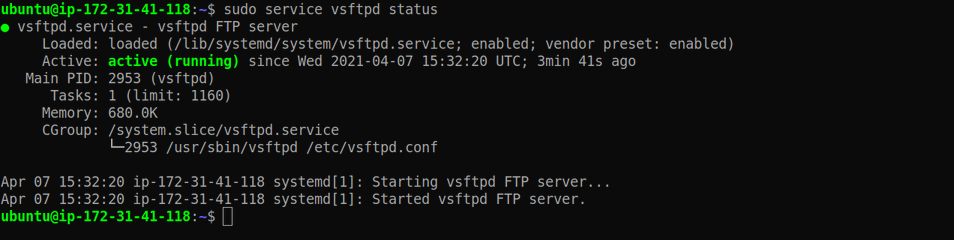
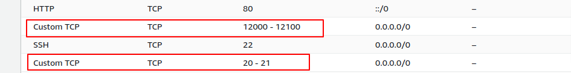
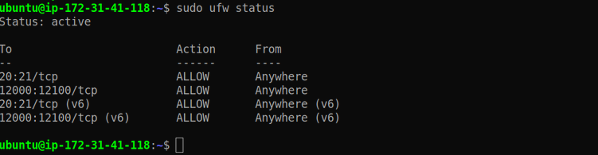

```toc
# This code block gets replaced with the TOC
```

## I. Chuẩn bị
- Cần có một server EC2 trên AWS (hệ điều hành Ubuntu)
- Cần có khả năng SSH vào EC2 với quyền sudo

## II. Các bước cài đặt
### 1. Cài đặt vsftpd
Cài đặt phần mềm `vsftpd` để set up FTP server

```bash
# Cài đặt phần mềm
sudo apt install vsftpd

# Kiểm tra phần mềm có chạy chưa
sudo service vsftpd status
```
> vsftpd đang chạy



### 2. Cấu hình Firewall cho EC2
Trong `security groups inbound rules` của EC2, phải thêm vào các rules sau:
- Port 22 cho phép SSH
- Port 20 và 21 cho FTP
- Các port phụ từ 12000 tới 12100



---
**Lưu ý các bước bật firewall trong EC2 bên dưới có thể lược bỏ vì AWS đã bảo về bằng security group rồi**

Kiểm tra lại firewall bằng câu lệnh
```bash
sudo ufw status
```

Nếu là status đang là inactive thì chúng ta có thể enable nó lên bằng câu lệnh
```
sudo ufw allow 20:21/tcp
sudo ufw allow 12000:12100/tcp
sudo ufw enable
```

Kiểm tra status sau khi bật firewall
```bash
sudo ufw status
```


### 3. Tạo FTP User
Bây giờ ta tạo một linux user mới để cho phép truy cập thông qua FTP. Đặt tên `ftp_user` cho user này
```bash
# câu lênh này sẽ tạo user ftp_user và thư mục /home/ftp_user (Thư mục default khi SSH hoặc FTP bằng user này)
sudo adduser ftp_user
# Lưu ý nhớ username và password khi tạo
```

Chúng ta sẽ loại bỏ quyền SSH của user này chỉ cho phép truy cập bằng FTP. Cập nhật file cấu hình SSH là `/etc/ssh/sshd_config`
```bash
sudo vi /etc/ssh/sshd_config
```

Thêm 1 dòng bên dưới, để không cho user `ftp_user` ssh
```
DenyUsers ftp_user
```

Lưu lại file và restart SSH service
```bash
sudo service sshd restart
```


### 4. Cấu hình quyền của FTP User
Chọn một home directory cho user này, directory này có thể đã tồn tại hoặc tạo mới. Dưới đây là các bước để tạo mới, trường hợp chọn thư mục đã tồn tại thì không cần phải tạo

> Tạo thư mục chính
```bash
# Tạo thư mục mới
sudo mkdir /home/ftp_user/ftp_files

# Set ownership của thư mục này là nogroup (không thuộc về user/group nào)
sudo chown nobody:nogroup /home/ftp_user/ftp_files

# cấp mọi quyền trừ quyền write trên thư mục này
sudo chmod a-w /home/ftp_user/ftp_files
```

> Tạo thư mục để upload
```bash
# Tạo thư mục phụ "uploads"
sudo mkdir /home/ftp_user/ftp_files/uploads

# Set user "ftp_user" sở hữu thư mục phụ này
sudo chown ftp_user:ftp_user /home/ftp_user/ftp_files/uploads
```

> Note: đối với những ai đã quen thuộc với việc cấp quyền trên file của linux: chown, chmod ... thì các bạn có thể tự tùy chỉnh thư mục và các quyền read/write sao cho hợp lý là được
### 5. Cấu hình FTP server
Before configuring the vsftpd configuration file located in /etc/vsftpd, take a backup of the file.

Trước khi cấu hình cho vsftpd service, tạo 1 file backup
```bash
# Tạo file back up "vsftpd.conf.bak"
sudo cp /etc/vsftpd.conf /etc/vsftpd.conf.bak

# Dùng vi để chỉnh sửa file (có thể dùng vim/nano tùy thích)
sudo vi /etc/vsftpd.conf
```

> Tìm các dòng tương ứng để enable nó lên hoặc thêm mới các dòng cấu hình sau
```bash
listen=YES                            #
listen_ipv6=NO                        # Không dùng IPv6 cho FTP
write_enable=YES                      #
chroot_local_user=YES                 # Nhốt FTP user lại chỉ hoạt động trong thư mục cố định
local_umask=022                       # Set default permissions for uploaded directory (775) and file (664)
force_dot_files=YES

pasv_enable=YES
pasv_min_port=12000
pasv_max_port=12100
port_enable=YES

pasv_address=x.x.x.x                   # Địa chỉ IPv4 của server
user_sub_token=$USER
local_root=/home/$USER/ftp_files
```

> Restart vsftpd service để cập nhật những thay đổi
```bash
sudo systemctl restart vsftpd
sudo service vsftpd status
```

**Bây giờ ta có thể truy cập tới server dưới dạng FTP để upload, download, xóa trong thư mục chỉ định**

```bash
# Kết nối FTP tới server ip x.x.x.x
ftp x.x.x.x
# Nhập username và password (ở đây username là ftp_user)
```