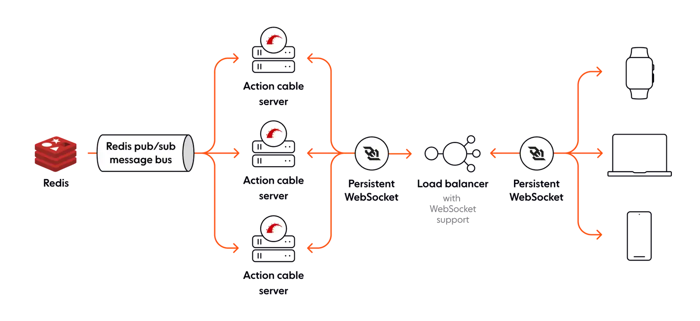

```toc
# This code block gets replaced with the TOC
```

## Giới thiệu Action Cable

Trong các ứng dụng Rails phổ biến thì đa phần chúng ta dùng mô hình truyền thống của HTTP là request-wait-response. Nhưng cũng sẽ có những trường hợp chúng ta cần các phản hồi tức thì (real time) như: chat, notification, realtime data dashboard... Action Cable là câu trả lời của Rails (Rails >= 5) để làm việc với các tác vụ realtime kiểu này thông qua kết nối bằng Websocket.

Trong bài post này chúng ta sẽ tìm hiểu về Action Cable và mình họa cách set up để làm việc với ReactJS.

## I. Action Cable

Trước khi chúng ta nhảy vào làm việc với Action Cable thì chúng ta cũng nên hiểu về cách ActionCable hoạt động:

### 1. Cách ActionCable làm việc

> Ví dụ ActionCable sử dụng adapter `redis`



- Pub/Sub streams: Sử dụng tính năng Pub/Sub của `Redis``. Nó cho phép có nhiều hơn 1 Rails server trong việc chia sẽ state (ví dụ như gửi message tới tất cả các server). Mỗi stream sử dụng 1 Redis channel riêng biệt.
- Đơn vị để phân bổ message là 1 pub/sub stream, mỗi message được gửi thông qua một **stream broadcast** trong ActionCable.
- ActionCable server chạy như một `Rack server`` riêng biệt, tuy nhiên nó có thể được lựa chọn "gắn" vào trong Rails App chính hoặc đứng một mình như một ứng dụng riêng. Trong trường hợp nó chạy riêng thì bạn phải lưu ý đến vấn đề authentication (port khác, domain khác)
- Client-Side kết nối tới Server sử dụng `Websocket``. Trong trường hợp bạn sử load balancers thì chúng phải hỗ trợ Websocket và giữ các kết nối này mở liên tục giữa phía Client-Side và một trong các ActionCable servers.
- Việc kiểm soát những data gì sẽ được truyền đi (broadcasted) đến clients được thực hiện thông qua class `Channel`. Tại các Channel chúng ta có thể sử dụng bất cứ Business logics nào Rails app chính nếu muốn.

### 2. Ưu điểm của ActionCable

#### Đơn giản việc kết nối và chia sẽ khả năng authentication

Mỗi `Connection` chỉ đơn giản là một Ruby object và Ruby object là một phần của Rails app, chia sẽ business logic bao gồm authentication là một việc siêu đơn giản. Ví dụ, nếu một cookie-base authen được cấp trong một HTTP request, những kết nối Websocket sau đó sẽ gửi cookie đó như là một phần của Websocket request, bởi vậy các kết nối này được authenticate theo cùng một cách.

Bởi vì một connection sẽ tồn tại lâu dài, nên việc authentication chỉ cần thực hiện một lần (lúc kết nối lần đầu) và tất cả các Channel objects có thể truy cập đến authenticated users thông qua việc sử dụng method `identified_by` ủy thác ở mối Channel.

> Lưu ý: Khả năng chia sẽ cookie-base authentication chỉ có thể sử dụng cho các ActionCable server gắn với Rails app ở cùng endpoint, nếu ActionCable server ở một port khác hoặc một domain khác thì việc này không thể được

#### Websocket được gắn ở cùng một endpoint

Khả năng gắn Websocket endpoint được gắn trực tiếp trong Rails app là một thắng lợi lớn, nó đơn giản hóa việc deployment và cho phép chia sẽ cookies.

#### Channel object cho mỗi connection

Các `Channel objects` được tạo cho mỗi `subscription`` mới được tạo ra trên mỗi connection. Ý tưởng khá đơn giản để hiểu, và Rails lo liệu việc tạo và hủy các Channel objects cho các subscriptions hoặc các connections cơ bản.

#### Tự động phục hồi các connection và subscription

ActionCable Client-Side library (JS lib) chịu trách nhiệm cho việc duy trì connection và nối lại tất cả các subscriptions đến các Channels. Ví dụ, nếu một kết nối của bạn bị chấm dứt đột ngột, ActionCable Client-Side library sẽ tái thiết lập một kết nối và subscribe tới tất cả các subscriptions trước kia một cách tự động.

#### Sockets 2 chiều

ActionCable là song hướng nên brower clients có thể nhận data được truyền xuống tới bằng cách sử dụng method `received`, nhưng nó cũng có thể truyền data lên tới các public methods ở channel thông qua method `perform`

#### Dựa trên Redis

Sử dụng Redis để xây dựng Pub/Sub channels là một lựa chọn tốt. Redis cung cấp một giải pháp với performance cao và ổn định.

#### Chia sẽ View logic

Bới vì Channel objects là một phần của Rails app, về lý thuyết, việc render view thay vì gửi data thuần túy tới ActionCable Client là một việc hoàn toàn khả thi. Việc này có thể đơn giản Front-End logic bởi vì nó không cần phải hiểu để render dựa trên data nhận nữa, thay vào đó nó chỉ đơn giản là thay thế 1 DOM element bằng HTML nhận được. Ý tưởng chính là View content được ActionCable Server push tới client thay vì client phải pull content như trước kia.

### 3. Nhược điểm của ActionCable

#### Connection state

Bởi vì ActionCable là một process chạy lâu dài, mỗi connection được thiết lập có state ở Server-Side kéo dài mãi miễn là connection duy trì trọn vẹn. State này được lưu trữ hoặc liên kết tới mỗi Channel object được tạo cho mỗi Client subscriptions. Tuy nhiên, có một vấn đề là mỗi khi mất kết nổi và dẫn tới việc tái kết nổi tới server lại thì sẽ dẫn tới kết quả là tất cả state sẽ bị mất vì Channel object cho mỗi subscriptions sẽ bị xóa bỏ. Nhìn như đây có vẻ là một lỗi nhưng không, việc này vẫn thường xảy ra mỗi lần một user refresh browser của họ, chuyển qua một trang khác, hoặc khi ta deploy code mới lên server.

Nếu connection state bị mất, thì tất cả các messages được gửi trong khi client mất kết nối cũng bị mất. ActionCable không hỗ trợ phát hiện client mất kết nối hoặc phát lại những message khi client mất kết nối. Nếu bạn không thích việc các messages bị mất (gửi khi client offline), không biết khi nào client offline, ActionCable có vẻ không dành cho bạn.

Với tư cách là một developer, bạn nên cân nhắc thêm vào một số cách để quản lý state trên server trong khi connections bị ngắt kết nối. Tuy nhiên, nếu bạn theo hướng này thì bạn phải ý thức được rằng:\

- Thứ nhất khi mỗi reconnection thông qua websocket có thể không đến cùng một ActionCable server
- Thứ hai bạn sẽ cần một cách hiệu quả để theo dõi ai đã nhận những messages nào (tránh trùng lặp message ở memory)
Duy trì connection state theo hướng có thể phục hồi (sau khi disconnect và reconnect) quá phức tạp, có thể là lý do mà Rails team không làm theo hướng này.

#### Single point of failure (SPOF)

ActionCable được "chống lưng" bởi Redis Pub/Sub. Tuy Redis là một ứng dụng database tuyệt vời nhưng vẫn có thể có lỗi xảy ra với Redis, và khi Redis server bị downtime thì ActionCable cũng bị theo.

#### Độ trễ - Latency

Action cable cung cấp việc gửi message 2 chiều bằng một kết nối Websocket, tuy nhiên mỗi message được gửi hoặc nhận sẽ được định hướng thông qua Rails server(s) trong một trung tâm data duy nhất (ở dây là Redis). Nếu bạn build 1 service platform mà độ trễ rất quan trọng với bạn ví dụ các ứng dụng cho game online, dịch vụ tài chính ... thì bạn sẽ có 1 vấn đề khi users không ở gần servers của bạn. Một ví dụ cụ thể hơn là nếu bạn có 2 users chơi realtime game ở Úc, mà Rails server ở Châu Âu thì mỗi message được ActionCable gửi sẽ đi nửa vòng trái đất rồi vòng về.

Thông thường chúng ta có thể đặt thêm các Rails servers ở Úc (để giảm khoảng cách từ user tới server), tuy nhiên cách này sẽ không phù hợp với ActionCable dùng Redis vì chỉ luôn có 1 single Redis database.

#### Lỗi đột ngột có thể làm hỏng các state

Giả sử bạn đang build 1 ứng dụng chat và nó có chức năng theo dỗi những ai đang online. Khi 1 new subscriber connect tới một channel, bạn có để lưu thông tin user(đang online) đó ở Redis Set, và khi unsubscribe thì sẽ xóa nó đi. Tuy nhiên, nếu có lỗi đột ngột ở server thì bạn có thể sẽ không bao giờ biết khi nào nên remove thông tin user ở Redis, và user đó có thể xem như online vĩnh viễn ở channel đó.

Việc lỗi đột ngột có thể xảy ra khi server downtime hoặc việc deploy reload app xảy ra.

Để giải quyết vấn đề kiểu này bạn phải thiết kế 1 cluster chia sẽ global states (1 member sẽ có states của toàn bộ các members khác). Nhờ đó mà khi 1 server A nào đó bị lỗi đột ngột thì server B có thể kiểm tra và xóa các state lỗi ở server A.

#### Không hỗ trợ ACK/NACK

Chúng ta sẽ không biết được 1 message khi được gửi bởi ActionCable sẽ gửi thành công (ACK) hay gửi thất bại (NACK) tới client.
Rõ ràng là nếu không có các giải pháp dự phòng cho việc gửi thất bại thì ActionCable không phải là một giải pháp đáng tin cậy cho việc gửi và nhận message.

#### Thứ tự của messages

Nếu thứ tự các messages được gửi là điều quan trọng thì ActionCable không phải là lựa chọn phù hợp. Mỗi message được gửi không có một số thứ tự nên việc đảm bảo các messages được nhận theo thứ là không thể. Thậm chí nếu nó có thể, hoặc bạn xây dựng 1 middleware để làm việc đó (ở phía Rail server) thì ở bên khác phía Redis mỗi pub/sub event đều xử lý realtime (không quan tâm số thứ tự).

#### Chỉ hỗ trợ browers mới

ActionCable không sử dụng các libraries JS nổi tiếng về Websocket như Engine.io hoặc SockJS để handle ở phía client side. Mà họ chọn tự build giải pháp của riêng mình và chỉ hỗ trợ cách Modern browsers.

#### Không hỗ trợ nhiều nền tảng khác

ActionCable chỉ có hỗ trợ hạn chế các JS libraries để làm việc ở trên các browsers. Hiện nay không có các clien libraries để làm việc trên iOS, Android, Go, Python ...

Nếu bạn muốn hệ thống của bạn làm việc với các nền tảng khác ngoài browsers thì bạn phải tự build giải pháp cho riêng bạn.

### 4. Một vài use cases của Action Cable

- Site notifications and alerts — Gửi notifications tới các users
- Live chat - Hỗ trợ chat realtime tới user hoặc cho phép các user chat với nhau.
- Content stream - Cập nhật content trên web page realtime
- Singlage Page App - Toàn bộ content trên một web page sẽ được cập nhật realtime, không cần navigate để chuyển trang.
